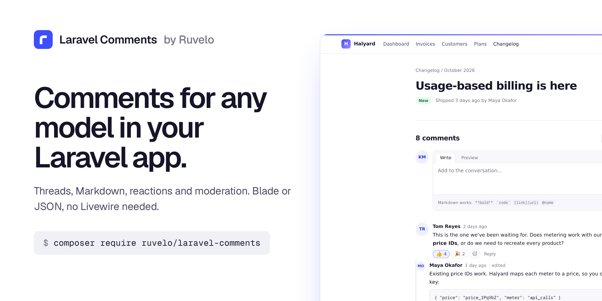
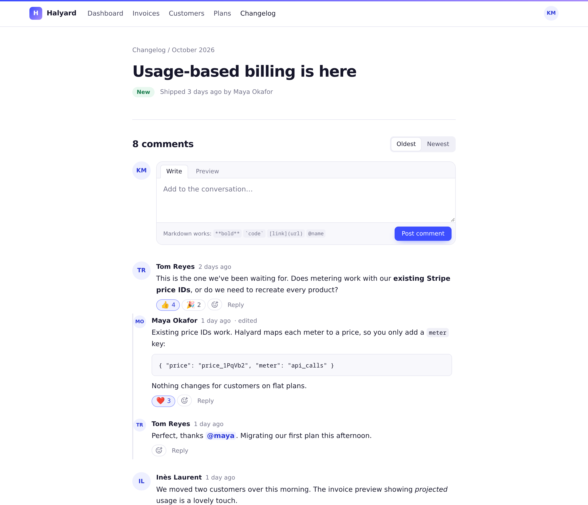
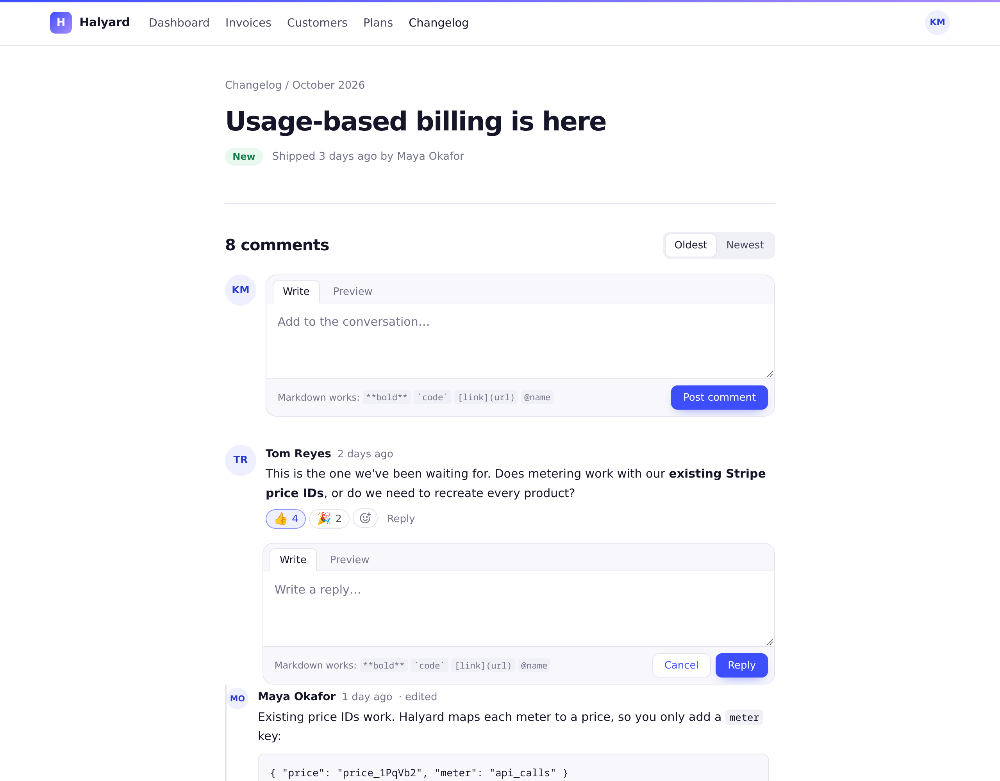
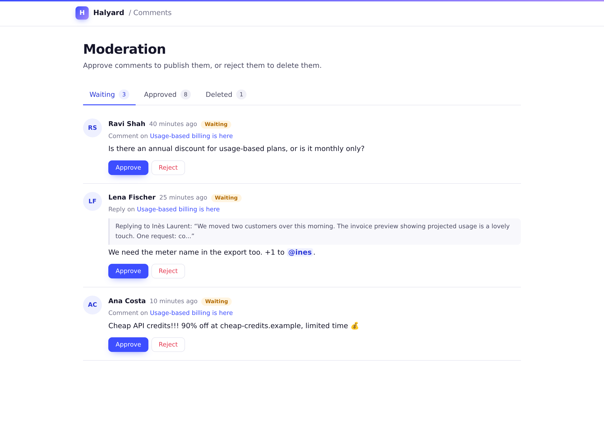
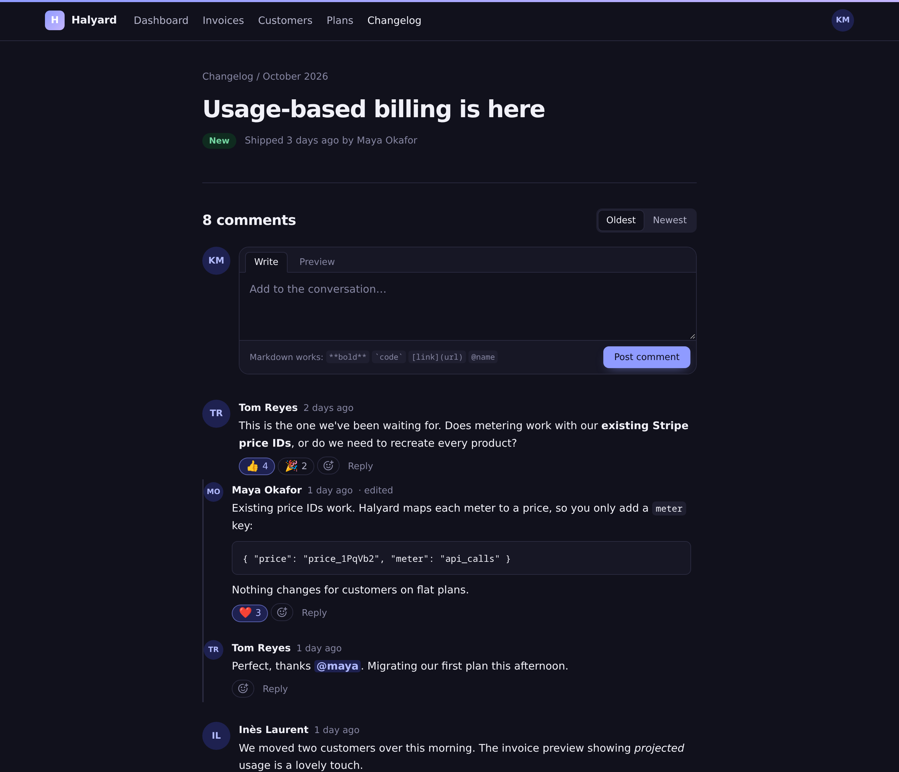
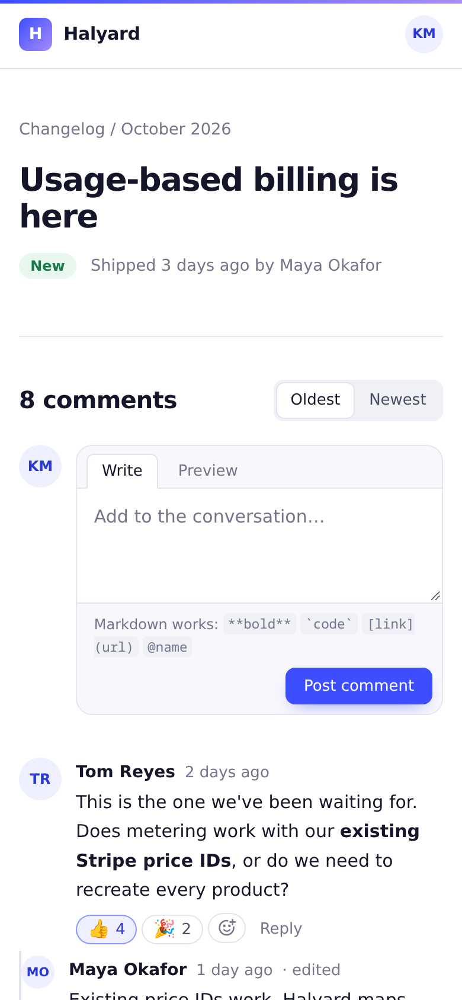

<p align="center">
  <a href="https://ruvelo.github.io/laravel-comments/"></a>
</p>

<p align="center">
  <a href="https://ruvelo.github.io/laravel-comments/"><strong>Live demo</strong></a> &nbsp;&nbsp;&nbsp;
  <a href="#configuration"><strong>Configuration</strong></a> &nbsp;&nbsp;&nbsp;
  <a href="#for-developers"><strong>Developer guide</strong></a> &nbsp;&nbsp;&nbsp;
  <a href="CHANGELOG.md"><strong>Changelog</strong></a>
</p>

<p align="center">
  <a href="https://github.com/Ruvelo/laravel-comments/actions/workflows/tests.yml"></a>
  
  
  
  <a href="LICENSE"></a>
</p>

# Laravel Comments

**Free, polished comments for any Eloquent model.** Threaded replies, Markdown, reactions, @mentions and an optional moderation queue. One Blade component for server-rendered apps, JSON on every route for Inertia, React and Vue. No Livewire required, no frontend build step, no extra services.

```
composer require ruvelo/laravel-comments
php artisan migrate
```

Add `use HasComments;` to a model, register it in `config/comments.php`, and drop `<x-comments::thread :for="$post" />` into its page. Or click around the [live demo](https://ruvelo.github.io/laravel-comments/) first.

## A quick tour



**Comments where your content is.** A thread under a post, an invoice, a ticket or anything else with an Eloquent model. Replies nest to the depth you choose, code blocks and `@mentions` render properly, and people react with one click.



**Write, preview, post.** The compose box has a Write/Preview toggle and a Markdown hint. Replies and edits open in place and post without a reload. With JavaScript off, every button is still a plain HTML form that works.



**Moderate when you need to.** Turn on `require_approval` and new comments wait in a queue until a moderator approves them. Each item links to where it lives.

<table>
  <tr>
    <td width="50%"></td>
    <td width="50%"></td>
  </tr>
  <tr>
    <td><strong>Light and dark</strong>, following each reader's system setting.</td>
    <td><strong>Mobile first</strong>, readable and usable at phone width.</td>
  </tr>
</table>

## Features

- **Any model, any author**: a `HasComments` trait for what's commented on, and any model as the author (your `User`, a `Customer`, a `Team`). Both are polymorphic.
- **Threads**: replies nest up to `max_depth` (2 by default: comments and replies). A reply to the deepest level joins that level instead of nesting further.
- **Safe Markdown**: GitHub-style, with code blocks, tables and task lists. Raw HTML is escaped, `javascript:` links are dropped, outside links get `rel="nofollow"`, and images become links so readers never load a stranger's URL.
- **Mentions**: `@maya` links to a person and notifies them. Plug in your own resolver, or use the bundled one that looks up a `username` column.
- **Reactions**: a fixed set of emoji (👍 ❤️ 🎉 😄 😮 😢 by default), one of each per person, toggled with a click. Hover a reaction to see who gave it.
- **Edits and deletes**: edited comments say so. A deleted comment with replies stays as "This comment was deleted", so the conversation still makes sense.
- **Moderation**: an optional approval queue and a moderation page with waiting, approved and deleted tabs.
- **Permissions as gates**: sensible defaults, each overridable with one `Gate::define`.
- **Spam and abuse**: per-author rate limiting, a honeypot field and a length limit.
- **Notifications**, off by default: the model's owner hears about new comments, authors hear about replies, mentioned people hear they were mentioned. Standard Laravel notifications whose `toArray()` has `title`, `body` and `url`, so they show up in [ruvelo/laravel-inbox](https://github.com/Ruvelo/laravel-inbox) with no setup.
- **Works without JavaScript**, and gets better with it: posting, editing, deleting, reactions and previews happen in place.
- **JSON API** on the same routes for SPAs, Inertia, Livewire or mobile apps: paginated threads with nested replies, create, update, delete, react and preview.
- **Fast**: a thread page takes the same handful of queries whether it has 2 comments or 200 (there's a test for that).
- **Light and dark**, self-contained styles that never leak into your page, and accessible markup: labels, roles, `aria-pressed` reactions, keyboard-operable everything.

## Requirements

- PHP 8.3+
- Laravel 12 or 13
- Any database Laravel supports (tested on SQLite)

## Getting started

**1. Make a model commentable** and list it under a short name. The name is what URLs and the JSON API use; class names sent by a browser are never trusted.

```php
use Ruvelo\Comments\Concerns\HasComments;

class Post extends Model
{
    use HasComments;

    // Optional: where the post lives, for permalinks, notifications and moderation.
    public function commentUrl(): ?string
    {
        return route('posts.show', $this);
    }
}
```

```php
// config/comments.php (php artisan vendor:publish --tag=comments-config)
'commentables' => [
    'post' => App\Models\Post::class,
],
```

Aliases from your `Relation::morphMap()` work too.

**2. Show the thread** on the post's page:

```blade
<x-comments::thread :for="$post" />
```

It brings its own styles and script, included once per page. Signed-in users can comment; guests see the thread and a "Sign in to comment" link to your `login` route (or plain text if you don't have one).

**3. Optionally, tell it about your users.** Without anything, authors show their `name` and initials. Implement `CommentAuthor` to choose a name or add real avatars:

```php
use Ruvelo\Comments\Concerns\IsCommentAuthor;
use Ruvelo\Comments\Contracts\CommentAuthor;

class User extends Authenticatable implements CommentAuthor
{
    use IsCommentAuthor;

    public function commentAuthorAvatarUrl(): ?string
    {
        return $this->profile_photo_url;
    }
}
```

### Hooks on the commentable

All optional; `HasComments` provides defaults.

| Method | Default | |
|---|---|---|
| `commentsAreOpen(): bool` | `true` | Return `false` to close the thread. Existing comments stay visible |
| `commentUrl(): ?string` | `null` | Where the model lives. Used by permalinks, notifications and the moderation page |
| `commentTitle(): string` | its `title`, `name` or "Post #12" | How the model is named in notifications and moderation |
| `commentNotifiables(): iterable` | `[]` | Who hears about new comments when notifications are on, usually the owner |

## Who can do what

Every write goes through a gate. Define a gate with the same name to decide yourself, for example in your `AppServiceProvider`:

| Gate | Arguments | Default |
|---|---|---|
| `comments-create` | `$user, $commentable` | Any signed-in user |
| `comments-update` | `$user, $comment` | The author, within `edit_window` |
| `comments-delete` | `$user, $comment` | The author, or a moderator |
| `comments-react` | `$user, $comment` | Any signed-in user, on published comments |
| `comments-moderate` | `$user` | Nobody, until you define it |

```php
use Illuminate\Support\Facades\Gate;

Gate::define('comments-moderate', fn ($user) => $user->is_admin);
Gate::define('comments-create', fn ($user, $post) => $user->hasVerifiedEmail());
```

## Moderation

Set `require_approval` to `true` and new comments wait until someone who passes `comments-moderate` approves them. Their author still sees them, marked "Waiting for approval"; moderators' own comments are approved straight away.

Moderators review the queue at `/comments/moderation`: waiting, approved and deleted tabs, Approve and Reject (which deletes), and a link to where each comment lives.

## Configuration

Publish the config file to change the defaults:

```
php artisan vendor:publish --tag=comments-config
```

| Key | Default | |
|---|---|---|
| `commentables` | `[]` | Short name ⇒ model class. Only these (and morph map aliases) are accepted from requests |
| `path` | `comments` (`COMMENTS_PATH`) | URL prefix for every route |
| `domain` | `null` | Serve the routes on another (sub)domain |
| `middleware` | `['web']` | Applied to every route. The signed-in user is the session's |
| `routes` | `true` | Set to `false` to register routes yourself (copy `routes/web.php`) |
| `max_depth` | `2` | Levels a thread shows: 1 is flat, 2 is comments and replies |
| `per_page` | `20` | Top-level comments per page; their replies always come along |
| `sort` | `oldest` | Default order, `oldest` or `newest`. Readers can switch |
| `max_length` | `5000` | Characters per comment |
| `edit_window` | `null` | Minutes authors may edit after posting; `null` for always |
| `require_approval` | `false` | Hold new comments for a moderator |
| `rate_limit` | 5 per 1 minute | Per author, through the routes. `max => null` turns it off |
| `honeypot` | `website` | Hidden field name; posts that fill it are dropped. `null` turns it off |
| `reactions` | 👍 ❤️ 🎉 😄 😮 😢 | The emoji people can react with; `[]` turns reactions off |
| `mentions.resolver` | `null` | A `MentionResolver` class, e.g. `ColumnResolver::class`; `null` turns mentions off |
| `mentions.model` / `.column` / `.route` | users model / `username` / `null` | Used by `ColumnResolver`: where to look handles up and what to link to |
| `notifications.enabled` | `false` (`COMMENTS_NOTIFICATIONS`) | Send notifications |
| `notifications.channels` | `['database']` | Any Laravel channels, e.g. `['database', 'mail']` |
| `author_name_attribute` | `name` | Shown for authors that don't implement `CommentAuthor` |
| `markdown.extensions` | `[]` | Extra CommonMark extensions |
| `markdown.options` | `[]` | CommonMark options. `html_input` and `allow_unsafe_links` can't be loosened |
| `layout` | `null` | Your layout view for the moderation page; `null` uses the package's |
| `layout_section` | `content` | The section the moderation page fills in your layout |
| `table_prefix` | `ruvelo_` | Tables are `ruvelo_comments` and `ruvelo_comment_reactions`, clear of any `comments` table your app already has |
| `run_migrations` | `true` | Set to `false` if you publish and run the migration yourself |

## Making it look like your app

The thread's styles are scoped to `.comments` and driven by CSS variables. Override any of them on `.comments` to re-theme:

```css
.comments { --comments-accent: #0f766e; --comments-radius: 4px; --comments-sans: Inter, sans-serif; }
```

The thread follows the reader's light or dark setting. If your app is light-only, pin it: `<x-comments::thread :for="$post" data-theme="light" />` (or `dark`).

For deeper changes, publish the views:

```
php artisan vendor:publish --tag=comments-views
```

They land in `resources/views/vendor/comments`: `components/thread.blade.php`, the `partials/` it's built from (one comment, the form, reactions, styles and script), and `moderation.blade.php`. To put the moderation page inside your app's chrome, set `layout` to your layout view; the page fills the `layout_section` section.

## For developers

### PHP API

`Ruvelo\Comments\Comments` is the one write path: the routes use it too.

```php
use Ruvelo\Comments\Comments;

$comment = Comments::post($post, $user, 'Ship **it**');           // or a reply:
Comments::post($post, $other, 'Thanks @maya', parent: $comment);
Comments::update($comment, 'Ship **it** on Friday');               // marks it edited
Comments::delete($comment, by: $user);                             // soft: replies stay
Comments::react($comment, $user, '🎉');                            // true when added, false when removed
Comments::approve($comment);

Comments::for($post)->latest()->limit(5)->get();   // published comments, authors and reactions loaded
Comments::thread($post, viewer: $user, sort: 'newest');  // a page as $user sees it, replies nested
Comments::countFor($post);
Post::withCommentsCount()->get();                  // adds comments_count, no N+1
Comments::render('**Markdown**');                  // the same safe HTML comments get
Comments::allows('comments-update', $user, $comment);
```

The PHP API doesn't check permissions or rate limits, so imports and seeders aren't slowed down. Call `Comments::allows()` (or `authorize()`, which throws `NotAllowed`) when acting for a user.

### JSON API

Every route answers JSON when the request sends `Accept: application/json`, so the same endpoints serve the Blade component, Inertia pages and SPAs. They use the session (the `web` middleware) by default; set `middleware` to suit your app, e.g. `['web', 'auth:sanctum']`. The `{type}` is the short name from `commentables`.

| Request | Does |
|---|---|
| `GET /comments/threads/{type}/{id}?sort=&page=&per_page=` | A page of top-level comments, each with nested `replies`. `meta` adds `comments_count`, `can_comment`, `reactions` and `max_depth` |
| `POST /comments/threads/{type}/{id}` | Create `{body, parent_id?}`. `201` with the comment, `comments_count`, `message` and a rendered `html` fragment |
| `PATCH /comments/{id}` | Update `{body}` |
| `DELETE /comments/{id}` | Delete. The comment comes back with `deleted: true` |
| `POST /comments/{id}/reactions` | Toggle `{emoji}`. Returns `added` and the new `reactions` |
| `POST /comments/preview` | `{body}` in, `{html}` out |
| `GET /comments/moderation/{status?}` | The queue (`pending`, `approved`, `deleted`) for moderators, with `meta.counts` |
| `POST /comments/{id}/approve` | Approve a waiting comment |
| `GET /comments/{id}` | Permalink: redirects to the model's `commentUrl()` at the comment |

A comment looks like this:

```json
{
  "id": 12, "parent_id": 9, "depth": 1,
  "author": { "name": "Maya Okafor", "initials": "MO", "avatar_url": null },
  "body": "Existing price IDs work.", "html": "<p>Existing price IDs work.</p>\n",
  "created_at": "2026-10-08T09:12:00+00:00", "edited_at": null,
  "approved": true, "deleted": false, "url": "https://app.test/comments/12",
  "reactions": [{ "emoji": "❤️", "count": 3, "reacted": true, "names": ["Tom Reyes", "Inès Laurent", "Kenji Mori"] }],
  "can": { "reply": true, "update": false, "delete": false, "react": true },
  "replies": []
}
```

Errors are JSON too: `401` for guests, `403` when a gate or a closed thread says no, `404` for unknown types or comments, `422` with `errors.body` for validation, and `429` when rate limited.

### Events

All in `Ruvelo\Comments\Events`, each with the `$comment`:

| Event | When |
|---|---|
| `CommentPosted` | A comment or reply is posted, approved or not (check `$comment->isApproved()`) |
| `CommentUpdated` | Its author edits it |
| `CommentDeleted` | It's deleted; `$by` is who did it, when known |
| `CommentApproved` | A moderator approves it |
| `ReactionToggled` | Someone adds or removes a reaction: `$reactor`, `$emoji`, `$added` |

### Exceptions

All extend `CommentsException`, and render themselves as the right HTTP response when thrown in a request: `CommentingClosed`, `NotAllowed`, `NotCommentable`, `InvalidParent`, `InvalidComment`, `InvalidReaction` and `TooManyComments`.

### Notifications

`Ruvelo\Comments\Notifications\CommentPosted` and `MentionedInComment` are regular notifications. `toArray()` returns `title`, `body`, `url` and `comment_id`; `toMail()` is there for the `mail` channel. Nobody is notified twice for one comment, or about their own.

### Mentions

Bundled: `Ruvelo\Comments\Mentions\ColumnResolver` matches `@handle` against one column of your user model, ignoring case. For anything else, implement `MentionResolver`:

```php
class TeamMentions implements MentionResolver
{
    public function resolve(array $handles): array   // lower-cased handle => model
    {
        return User::whereIn('slug', $handles)->get()->keyBy('slug')->all();
    }

    public function url(Model $person): ?string
    {
        return route('people.show', $person);
    }
}
```

### In your tests

```php
Comment::factory()->on($post)->by($user)->create();
Comment::factory()->replyTo($comment)->by($other)->pending()->create();
Comment::factory()->on($post)->by($user)->body('**Hi**')->edited()->create();
```

## Using an AI coding agent?

The package ships [Laravel Boost](https://laravel.com/docs/boost) guidelines in `resources/boost/guidelines/core.blade.php`. With Boost installed (`composer require laravel/boost --dev`), run `php artisan boost:install` and pick `ruvelo/laravel-comments` from the third-party packages (or `php artisan boost:update --discover` if Boost is already set up). Your agent then knows how to make models commentable, show the thread, register commentable types, define the gates, and use the JSON API, and what not to do.

## Contributing

Pull requests are welcome. Clone, `composer install`, then `composer check` runs code style (Pint), static analysis (PHPStan level 8) and the tests, exactly as CI does. See [CONTRIBUTING.md](CONTRIBUTING.md) and the [changelog](CHANGELOG.md).

The demo and screenshots are built from the package itself: `composer demo` writes the static demo into `build/`, and `demo/screenshots.sh` regenerates `art/`.

## Credits

Built by [François Bultez](https://github.com/francoisbultez) at [Ruvelo](https://github.com/Ruvelo), and everyone who [contributes](https://github.com/Ruvelo/laravel-comments/graphs/contributors).

## License

MIT. See [LICENSE](LICENSE).
